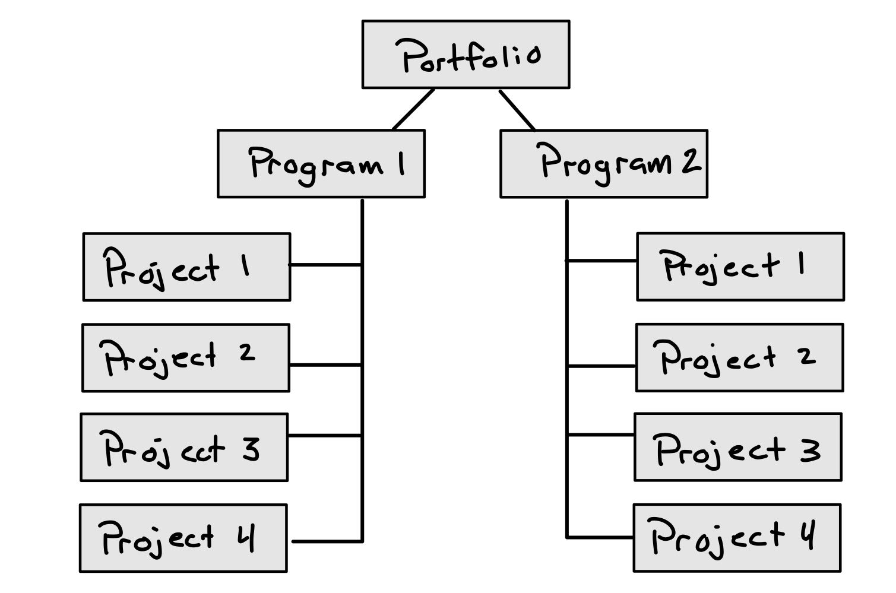

# Sybex PMP Study Guide Notes

## Chapter 01: Building the Foundation

### Establishing a baseline
Definition of a project:
* Temporary in nature.
* Definitive start and end dates.
* Produce a unique product, service, or result.
* Completed when goals and objectives are met and signed off by a **stakeholder**.

Operations are different from a project since operations are ongoing and repetive.

### Programs

Programs are a group of related projects, subsidiary programs, and other activities.
These are grouped together using similar management techniques and are meant to utilize benefits that wouldn't be present if the projects were to be managed individually.  

    

